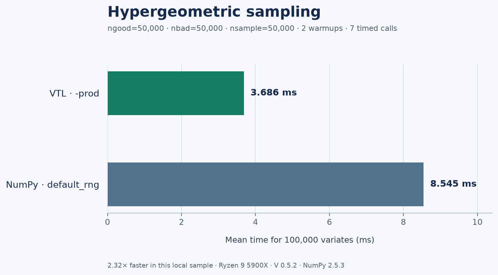
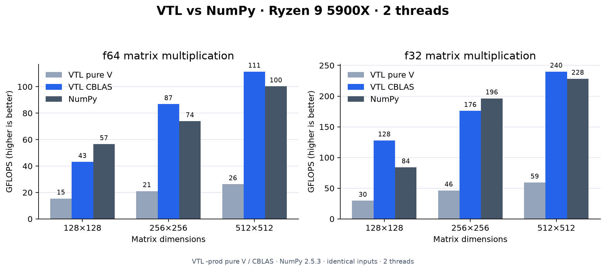
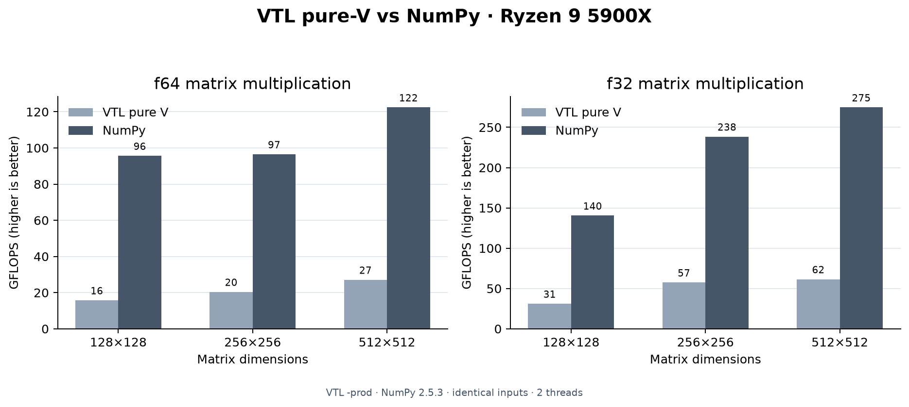

# VTL vs NumPy baselines

## Linear bias gradient reduction

The VTL and NumPy microbenchmarks reduce contiguous `f32` matrices along axis 0
and compare direct reduction with multiplying by a row of ones. The VTL
benchmark also measures `vsl.blas.sgemv(.trans, ...)`, once with pure V BLAS and
once with the system CBLAS backend. Each operation allocates its output inside
the timed region; input construction is outside it. Both programs use the same
deterministic values, eight `(batch, features)` shapes, five warmups, and 50
timed calls. This isolates the linear-layer bias-gradient operation; it does
not claim overall NumPy parity. Run from `~/.vmodules`:

```bash
systemd-run --user --scope --quiet -p MemoryMax=4G -p MemorySwapMax=0 -- env VJOBS=2 \
	v -no-parallel -cc gcc -prod -cflags "-march=native" -o /tmp/vtl-linear-bias-bench \
	./vtl/benchmarks/linear_bias_reduction_bench.v
systemd-run --user --scope -p MemoryMax=1G -p MemorySwapMax=0 -- env VJOBS=2 \
	/tmp/vtl-linear-bias-bench
systemd-run --user --scope --quiet -p MemoryMax=4G -p MemorySwapMax=0 -- env VJOBS=2 \
	v -no-parallel -cc gcc -prod -cflags "-march=native" -d vsl_blas_generic_cblas \
	-o /tmp/vtl-linear-bias-cblas-bench ./vtl/benchmarks/linear_bias_reduction_bench.v
systemd-run --user --scope -p MemoryMax=1G -p MemorySwapMax=0 -- env VJOBS=2 \
	/tmp/vtl-linear-bias-cblas-bench
systemd-run --user --scope --quiet -p MemoryMax=1G -p MemorySwapMax=0 -- env VJOBS=2 \
	OPENBLAS_NUM_THREADS=2 uv run --offline --no-project --with numpy python \
	./vtl/benchmarks/vs_numpy/numpy_linear_bias_reduction_baseline.py
```

Compile each V program before running its binary separately. The production
build uses GCC `-O3 -flto` through `-prod`; `-no-parallel` caps compiler-side
parallel work for this memory-constrained workstation. `-march=native` enables
CPU-specific code and must be omitted for portable binaries. Record the V
version, compiler, CPU, NumPy version, NumPy BLAS configuration, and thread
count with new results. The system `vsl_blas_generic_cblas` build exercises the
installed CBLAS and may not use OpenBLAS.

On an AMD Ryzen 9 5900X on 2026-10-09, with V 0.5.2 `407c52e`, GCC 16.2.1,
NumPy 2.5.3, scipy-openblas 0.3.34.106.0, and
`OPENBLAS_NUM_THREADS=2`, one `-prod -march=native` run measured:

| Shape | VTL pure-V sum (ms) | System CBLAS GEMV (ms) | NumPy sum (ms) | NumPy `ones @ matrix` (ms) |
| ---: | ---: | ---: | ---: | ---: |
| 32×64 | 0.0009 | 0.0006 | 0.0031 | 0.0012 |
| 128×256 | 0.0079 | 0.0086 | 0.0070 | 0.0027 |
| 1024×256 | 0.0581 | 0.0690 | 0.0279 | 0.0136 |
| 4096×512 | 0.4669 | 0.4798 | 0.1764 | 0.0618 |

The direct VTL reduction is competitive on small inputs but falls behind
NumPy/OpenBLAS as matrices grow. The host's generic CBLAS does not improve the
large reduction; this machine has no system OpenBLAS library, while NumPy's
wheel bundles a tuned, two-thread OpenBLAS. Treat these as workload-specific
measurements, not an overall performance claim. A fair backend parity run still
needs VTL linked to the same optimized BLAS implementation and thread count.

## Hypergeometric sampling

Both benchmarks draw 100,000 variates with `ngood=50,000`, `nbad=50,000`, and
`nsample=50,000`, after two warmups, then report the mean of seven calls. The
VTL benchmark uses its independent seeded generator; NumPy uses
`default_rng(42)`. Run from `~/.vmodules`:

```bash
systemd-run --user --scope --quiet -p MemoryMax=3G -p MemorySwapMax=0 -- env VJOBS=2 \
	v -prod -o /tmp/vtl-hypergeometric-bench ./vtl/benchmarks/vs_numpy/hypergeometric_bench.v
systemd-run --user --scope -p MemoryMax=1G -p MemorySwapMax=0 -- env VJOBS=2 /tmp/vtl-hypergeometric-bench
systemd-run --user --scope --quiet -p MemoryMax=768M -p MemorySwapMax=0 -- env VJOBS=2 \
	uv run --with numpy python ./vtl/benchmarks/vs_numpy/numpy_hypergeometric_baseline.py
```

On an AMD Ryzen 9 5900X with V 0.5.2 `5bd6709` and NumPy 2.5.3, one matched
run measured 3.686 ms for VTL `-prod` and 8.545 ms for NumPy. The VTL build
used a 3 GiB memory cap because its optimized compile exceeded 2 GiB; both
programs use independent PRNG algorithms and checksums are not expected to
match. This is one distribution and workload, not evidence of overall NumPy
performance parity.



[Open the SVG version](../../docs/assets/hypergeometric-performance.svg). The
plot script contains the measured values above; update those values after a new
benchmark run, then regenerate both images with:

```bash
systemd-run --user --scope --quiet -p MemoryMax=768M -p MemorySwapMax=0 --setenv=VJOBS=2 -- \
	uv run --with matplotlib python ./vtl/benchmarks/vs_numpy/plot_hypergeometric_benchmark.py
```

## Reduced SVD

Both programs compute reduced `f64` SVDs of identical deterministic square
matrices, with matrix construction outside the timed region. They warm up twice
and average five calls. Run from `~/.vmodules` under a memory-limited scope:

```bash
systemd-run --user --scope --quiet -p MemoryMax=4G -p MemorySwapMax=0 -- env VJOBS=2 \
	v -prod -o /tmp/vtl-svd-bench ./vtl/benchmarks/vs_numpy/svd_bench.v
systemd-run --user --scope -p MemoryMax=1G -p MemorySwapMax=0 -- env VJOBS=2 /tmp/vtl-svd-bench
systemd-run --user --scope --quiet -p MemoryMax=4G -p MemorySwapMax=0 -- env VJOBS=2 \
	OPENBLAS_NUM_THREADS=2 uv run --with numpy python \
	./vtl/benchmarks/vs_numpy/numpy_svd_baseline.py
```

The checksum sums all singular values across timed calls. Compare timings only
when recording the V backend, NumPy/BLAS build, CPU, and thread count.

On an AMD Ryzen 9 5900X on 2026-10-09 with V 0.5.2 `b69f626` `-prod` and
NumPy 2.5.3 using scipy-openblas 0.3.34 with `OPENBLAS_NUM_THREADS=2`, a
matched run measured:

| Size | VTL pure-V (ms) | NumPy (ms) | NumPy / VTL |
| ---: | ---: | ---: | ---: |
| 16×16 | 0.318 | 0.038 | 0.12× |
| 32×32 | 4.247 | 0.064 | 0.015× |
| 64×64 | 58.056 | 0.481 | 0.0083× |
| 128×128 | 858.147 | 3.011 | 0.0035× |

The pure-V SVD is substantially slower for these cases. This benchmark is a
performance gap report, not evidence of parity; optimized SVD backend dispatch
remains a priority before making CPU performance claims.

The PR benchmark comment reports pure-V, optional LAPACKE, and NumPy timings
for the same deterministic matrices. LAPACKE results use
`-d vsl_lapack_lapacke` and require LAPACKE to be installed. Changes under
`la/` trigger this comparison so future linear algebra work stays tied to
measured performance.

Run both sides from `~/.vmodules` under a memory-limited systemd scope. The VTL
benchmark calls `vtl.la.matmul` end to end, including tensor conversion and
result allocation. NumPy uses identical matrix values and sizes.

## Contiguous sum, mean, and variance

The VTL `stats_bench.v` measures contiguous sum and mean. The separate
`variance_bench.v` measures population variance. The NumPy baseline uses the
same `f64` values and calls `numpy.var` with its default `ddof=0`. Run both
from `~/.vmodules`:

```bash
systemd-run --user --scope -p MemoryMax=4G -p MemorySwapMax=0 -- env VJOBS=2 \
	v -prod -o /tmp/vtl-stats-bench ./vtl/benchmarks/vs_numpy/stats_bench.v
systemd-run --user --scope -p MemoryMax=1G -p MemorySwapMax=0 -- env VJOBS=2 /tmp/vtl-stats-bench
systemd-run --user --scope -p MemoryMax=4G -p MemorySwapMax=0 -- env VJOBS=2 \
	v -prod -o /tmp/vtl-variance-bench ./vtl/benchmarks/vs_numpy/variance_bench.v
systemd-run --user --scope -p MemoryMax=1G -p MemorySwapMax=0 -- env VJOBS=2 /tmp/vtl-variance-bench
systemd-run --user --scope --quiet -p MemoryMax=768M -p MemorySwapMax=0 -- env VJOBS=2 \
	OPENBLAS_NUM_THREADS=2 uv run --with numpy python \
	./vtl/benchmarks/vs_numpy/numpy_stats_baseline.py
```

These timings cover reductions on already allocated tensors/arrays. They do not
include input construction; record the compiler, NumPy build, CPU, and thread
settings when comparing results.

On an AMD Ryzen 9 5900X with V 0.5.2 `-prod` and NumPy 2.5.3, one matched-input
run measured VTL contiguous sum at 0.0092 ms for 100k values and 0.0940 ms for
1M; NumPy measured 0.0201 ms and 0.1534 ms. VTL population variance measured
0.0204 ms and 0.2108 ms; NumPy measured 0.0736 ms and 0.5227 ms. These
single-host samples show VTL faster for these cases, not a general performance
guarantee. Rerun the committed benchmarks on the target machine before using
them for release claims.

## Vector p=2 norm

The VTL and NumPy cases use the same 500,000-element `f64` input, warm up
three times, then report the mean of seven timed reductions. Input allocation
is outside the timed region. For contiguous `f64` data and `ord=2`, VTL
dispatches to VSL BLAS `dnrm2`. The default pure-V backend uses a scaled SIMD
accumulation with a direct-square fast path for ordinary magnitudes; builds
with `-d vsl_blas_cblas` use the configured CBLAS implementation. Run both
from `~/.vmodules`:

```bash
systemd-run --user --scope --quiet -p MemoryMax=768M -p MemorySwapMax=0 -- env VJOBS=2 \
	v -prod -o /tmp/vtl-vector-norm-purev ./vtl/benchmarks/vs_numpy/vector_norm_bench.v
systemd-run --user --scope -p MemoryMax=1G -p MemorySwapMax=0 -- env VJOBS=2 /tmp/vtl-vector-norm-purev
systemd-run --user --scope -p MemoryMax=4G -p MemorySwapMax=0 -- env VJOBS=2 \
	v -d vsl_blas_cblas -prod -o /tmp/vtl-vector-norm-cblas ./vtl/benchmarks/vs_numpy/vector_norm_bench.v
systemd-run --user --scope -p MemoryMax=1G -p MemorySwapMax=0 -- env VJOBS=2 \
	OPENBLAS_NUM_THREADS=2 /tmp/vtl-vector-norm-cblas
systemd-run --user --scope --quiet -p MemoryMax=768M -p MemorySwapMax=0 -- env VJOBS=2 \
	OPENBLAS_NUM_THREADS=2 uv run --with numpy python \
	./vtl/benchmarks/vs_numpy/numpy_vector_norm_baseline.py
```

Record V version, NumPy version, CPU, and BLAS build when comparing results.
On an AMD Ryzen 9 5900X with V 0.5.2 `-prod`, a matched run measured 0.517 ms
for the VTL pure-V backend and 0.170 ms for NumPy 2.5.3 with
`OPENBLAS_NUM_THREADS=2`; checksums matched within floating-point rounding.
VTL was about 3.0x slower for this case on the pure-V backend. On the same
host, the CBLAS route backed by the system `libcblas` measured 0.371 ms, about
1.4x faster than pure V but still about 2.2x slower than NumPy. This was not an
OpenBLAS measurement and is not a claim of NumPy performance parity. The pure-V
measurement used a 1.5 GiB `MemoryMax` and peaked at 1.1 GiB.

After the VSL norm fast path landed, a rerun on 2026-10-07 measured 0.309 ms
for VTL and 0.161 ms for NumPy on the same machine and input. Checksums matched;
VTL remained 1.92x slower. This run used V 0.5.2 `b69f626`, NumPy 2.5.3, and
`OPENBLAS_NUM_THREADS=2`. The OpenBLAS CBLAS build could not be rerun locally:
the installed system provides `libcblas`, but not the `libopenblas` linker name
required by `-d vsl_blas_cblas`.

## Matrix-chain ordering

This benchmark compares VTL and NumPy optimal matrix-chain ordering with a
left-associated chain for the same `400x40`, `40x4000`, and `4000x40` all-ones
matrices. The optimal association uses 7.04 million scalar multiplications; the
left-associated order uses 128 million. Both versions warm up twice, time ten
calls, and verify matching checksums.

Run from `~/.vmodules` with a memory-limited systemd scope:

```bash
systemd-run --user --scope --quiet -p MemoryMax=4G -p MemorySwapMax=0 -- env VJOBS=2 \
	v -cc gcc -keepc -prod -o /tmp/vtl-multi-dot-bench ./vtl/benchmarks/vs_numpy/multi_dot_bench.v
systemd-run --user --scope -p MemoryMax=1G -p MemorySwapMax=0 -- env VJOBS=2 /tmp/vtl-multi-dot-bench
systemd-run --user --scope --quiet -p MemoryMax=768M -p MemorySwapMax=0 -- env VJOBS=2 \
	OPENBLAS_NUM_THREADS=2 uv run --with numpy python \
	./vtl/benchmarks/vs_numpy/numpy_multi_dot_baseline.py
```

Record CPU, V version/build, NumPy/BLAS version, and thread count with results.
The shape-cost reduction does not imply that VTL matmul kernels are faster than
NumPy; compare the measured times on the same machine. The optimized GCC build
is compiled first and its output binary is timed separately.

On an AMD Ryzen 9 5900X, VTL used V 0.5.2 `5bd6709`, `-prod`, GCC, and the
pure-V matmul backend. NumPy 2.5.3 used scipy-openblas 0.3.34.106.0 with
`OPENBLAS_NUM_THREADS=2`. The identical inputs measured:

| Implementation | Ordering | Mean (ms) | Checksum |
| --- | --- | ---: | ---: |
| VTL | `multi_dot` | 0.9364 | 25600000000.0 |
| VTL | left-associated | 12.1205 | 25600000000.0 |
| NumPy | `multi_dot` | 0.2070 | 25600000000.0 |
| NumPy | left-associated | 2.5193 | 25600000000.0 |

The optimal order was 12.9× faster than the left-associated VTL chain; NumPy
`multi_dot` was 4.5× faster than VTL for this case. This is one matrix chain
and does not establish general NumPy performance parity. In the recorded
environment, selecting GCC explicitly avoided an interface type-check failure
with implicit compiler selection. `-keepc` retains generated C files for
debugging.

## Matmul

Run the f64 and f32 cases as separate programs so compiler memory stays
bounded; all V commands still run from `~/.vmodules`:

```bash
cd ~/.vmodules
systemd-run --user --scope --quiet -p MemoryMax=4G -p MemorySwapMax=0 -- env VJOBS=2 \
	v -prod -o /tmp/vtl-f64-bench ./vtl/benchmarks/vs_numpy/f64/main/main.v
systemd-run --user --scope -p MemoryMax=1G -p MemorySwapMax=0 -- env VJOBS=2 /tmp/vtl-f64-bench
systemd-run --user --scope -p MemoryMax=4G -p MemorySwapMax=0 -- env VJOBS=2 \
	v -prod -o /tmp/vtl-f32-bench ./vtl/benchmarks/vs_numpy/f32/main/main.v
systemd-run --user --scope -p MemoryMax=1G -p MemorySwapMax=0 -- env VJOBS=2 /tmp/vtl-f32-bench
```

Both programs use the same deterministic inputs as the NumPy baselines, three
warmups, ten timed calls, and an output sanity check. The combined benchmark
below remains useful on machines with more compiler memory.

```bash
systemd-run --user --scope --quiet -p MemoryMax=4G -p MemorySwapMax=0 -- env VJOBS=2 \
	v -prod -o /tmp/vtl-matmul-bench ./vtl/benchmarks/vs_numpy/matmul_bench.v
systemd-run --user --scope -p MemoryMax=1G -p MemorySwapMax=0 -- env VJOBS=2 /tmp/vtl-matmul-bench
```

```bash
systemd-run --user --scope --quiet -p MemoryMax=768M -p MemorySwapMax=0 -- env VJOBS=2 \
	OPENBLAS_NUM_THREADS=2 uv run --with numpy python \
	./vtl/benchmarks/vs_numpy/numpy_matmul_baseline.py
```

The same VTL benchmark measures single-precision matmul on the pure-V path
for sizes 128, 256, and 512. With CBLAS enabled, it measures sizes through
2048. Compare its `f32` rows against the matching NumPy end-to-end baseline;
both allocate a fresh result on each timed call and use the same inputs:

```bash
systemd-run --user --scope --quiet -p MemoryMax=4G -p MemorySwapMax=0 -- env VJOBS=2 \
	v -d vsl_blas_generic_cblas -prod -o /tmp/vtl-matmul-cblas \
	./vtl/benchmarks/vs_numpy/matmul_bench.v
systemd-run --user --scope -p MemoryMax=1G -p MemorySwapMax=0 -- env VJOBS=2 \
	OPENBLAS_NUM_THREADS=2 /tmp/vtl-matmul-cblas
systemd-run --user --scope --quiet -p MemoryMax=768M -p MemorySwapMax=0 -- env VJOBS=2 \
	OPENBLAS_NUM_THREADS=2 uv run --with numpy python \
	./vtl/benchmarks/vs_numpy/numpy_matmul_baseline.py
systemd-run --user --scope --quiet -p MemoryMax=768M -p MemorySwapMax=0 -- env VJOBS=2 \
	OPENBLAS_NUM_THREADS=2 uv run --with numpy python \
	./vtl/benchmarks/vs_numpy/numpy_matmul_f32_end_to_end.py
```

For a system CBLAS GEMM path on Linux, add `-d vsl_blas_generic_cblas` to the
V command. For OpenBLAS, use the existing `-d vsl_blas_cblas` flag when its
development package is installed. Keep the compiler mode and thread settings
in the report; results depend on both the V backend and NumPy's BLAS build.
With either CBLAS flag, VTL `f32` matrix multiplication dispatches to
single-precision CBLAS `sgemm`; without those flags, it uses VSL's pure-V
`sgemm` implementation. `f64` continues to use `dgemm`. The benchmark reports
both `f64` and `f32` results for either backend.

## Earlier local CPU sample

An earlier matched-input run on a Ryzen 9 5900X with V 0.5.2 `-prod` measured
dense 512×512 `f64` GEMM at 16.84 ms (15.9 GFLOPS); NumPy 2.5.3 measured
2.12 ms (126.5 GFLOPS). The VTL `f32` pure-V benchmark measured 6.02 ms at
the same size, while its NumPy baseline measured 1.16 ms. A generic system
CBLAS build measured 36.2 ms. These values are retained as an earlier sample;
the newer matched run at the end of this document supersedes them for the
current checkout. Both runs identify the CPU GEMM path as an optimization
target, not evidence of NumPy performance parity.

## Resident-buffer Vulkan f32 GEMM

This benchmark uploads both inputs once, reuses a GPU output buffer, and times
the VTL Vulkan GEMM operation without host readback in the timed section. Run
the NumPy reference with the same f32 inputs and a preallocated output:

```bash
systemd-run --user --scope --quiet -p MemoryMax=4G -p MemorySwapMax=0 -- env VJOBS=2 \
	v -prod -d vulkan -o /tmp/vtl-vulkan-matmul \
	./vtl/benchmarks/vs_numpy/vulkan_matmul_bench.v
systemd-run --user --scope -p MemoryMax=1G -p MemorySwapMax=0 -- env VJOBS=2 VTL_USE_VULKAN=1 /tmp/vtl-vulkan-matmul
systemd-run --user --scope --quiet -p MemoryMax=768M -p MemorySwapMax=0 -- env VJOBS=2 \
	OPENBLAS_NUM_THREADS=2 uv run --with numpy python \
	./vtl/benchmarks/vs_numpy/numpy_matmul_f32_baseline.py
```

The GPU result is read back only after timing to validate a checksum. Compare
these resident-buffer timings as accelerator kernel measurements; they exclude
CPU↔GPU transfer costs.

On the Ryzen 9 5900X with an RTX 3060, the tiled 32×32 Vulkan kernel measured
1.34 ms for 512×512, 4.39 ms for 1024×1024, and 42.95 ms for 2048×2048.
Earlier NumPy runs on the same host with two CPU BLAS threads measured 1.0 ms,
8.0 ms, and 62.2 ms respectively. This Vulkan kernel is about 1.8× faster at
1024×1024 and 1.4× faster at 2048×2048, while it remains slower at 512×512.

## Local matched run (2026-10-07)

The following `-prod` samples were collected on an AMD Ryzen 9 5900X with
`VJOBS=2` and `OPENBLAS_NUM_THREADS=2`. NumPy 2.5.3 used its bundled
scipy-openblas 0.3.34.106.0. VTL's optional CBLAS build was linked to the
cached scipy-openblas32 library through a temporary local symbol-alias shim;
the machine still has no system OpenBLAS installation. This exercises VTL's
`vsl_blas_cblas` path against optimized OpenBLAS, while the separately measured
pure-V path shows the no-BLAS baseline. Both used deterministic inputs and
timed matrix multiplication including result allocation. Higher GFLOPS is
better.

| dtype | size | VTL pure-V GFLOPS | VTL CBLAS GFLOPS | NumPy GFLOPS | NumPy / VTL CBLAS |
| --- | ---: | ---: | ---: | ---: | ---: |
| f64 | 128×128 | 15.44 | 43.10 | 56.54 | 1.31× |
| f64 | 256×256 | 21.06 | 86.80 | 73.93 | 0.85× |
| f64 | 512×512 | 26.24 | 111.41 | 100.25 | 0.90× |
| f32 | 128×128 | 29.67 | 127.88 | 84.03 | 0.66× |
| f32 | 256×256 | 46.37 | 175.97 | 196.32 | 1.12× |
| f32 | 512×512 | 59.28 | 239.91 | 228.40 | 0.95× |



At 512×512, VTL CBLAS measured 2.409 ms for f64 and 1.119 ms for f32; NumPy
measured 2.678 ms and 1.175 ms respectively in the same run. At 2048×2048 f32,
VTL CBLAS measured 71.619 ms and NumPy 66.222 ms, so the result varies by size
and dtype. The system's generic CBLAS backend measured 35.127 ms (f64) and
34.619 ms (f32) at 512×512 and is not representative of optimized OpenBLAS.
Regenerate the checked-in chart from the committed measurements with
`uv run --with matplotlib python ./vtl/benchmarks/vs_numpy/plot_local_matmul_results.py`
from `~/.vmodules`. These single-host results do not establish general
performance across hardware or workloads. The pure-V path remains several
times slower than optimized NumPy for the larger cases, while CBLAS results are
close and alternate which library is faster. The temporary shim is a local
benchmark aid only; normal users should link VTL against a supported CBLAS
installation.
These resident-buffer kernel measurements exclude CPU↔GPU transfers, so they
do not establish end-to-end superiority over NumPy.

## Pure-V baseline rerun (2026-10-07)

After the default Linux `dlange` path was made LAPACKE-free, the VTL end-to-end
benchmark and NumPy baselines ran on the Ryzen 9 5900X with V 0.5.2 `-prod`,
NumPy 2.5.3 backed by scipy-openblas 0.3.34.106.0, `VJOBS=2`, and
`OPENBLAS_NUM_THREADS=2`. The deterministic inputs and output checksums
matched. These measurements use VTL's default pure-V GEMM path, including
fresh output allocation; no temporary CBLAS shim is involved.

| dtype | size | VTL pure-V GFLOPS | NumPy GFLOPS | NumPy / VTL |
| --- | ---: | ---: | ---: | ---: |
| f64 | 128×128 | 15.76 | 95.63 | 6.07× |
| f64 | 256×256 | 20.41 | 96.50 | 4.73× |
| f64 | 512×512 | 27.10 | 122.42 | 4.52× |
| f32 | 128×128 | 31.10 | 140.43 | 4.52× |
| f32 | 256×256 | 57.45 | 238.49 | 4.15× |
| f32 | 512×512 | 61.53 | 274.72 | 4.46× |

Compiling VTL with `-cflags -march=native` improved the 512×512 result to
34.05 GFLOPS for f64 and 95.00 GFLOPS for f32, still below NumPy's 122.42 and
274.72 GFLOPS. This is a measured optimization gap, not a performance claim.
The chart below isolates this pure-V run from the earlier CBLAS measurements.



## Local matched pure-V rerun (2026-10-10)

A rerun on the same AMD Ryzen 9 5900X used V 0.5.2 (`407c52e`) with GCC
16.2.1, `-prod -cflags "-march=native"`, and `VJOBS=2`. VTL was compiled to
an executable before timing. NumPy 2.5.3 used its bundled scipy-openblas
0.3.34.106.0 with `OPENBLAS_NUM_THREADS=2`. Both benchmarks used the same
deterministic inputs. The f64 checksums match to six decimal places. The f32
checksums differ by at most `3.1e-4` in absolute value, consistent with their
different accumulation order. Higher GFLOPS is better.

| dtype | size | VTL pure-V GFLOPS | NumPy GFLOPS | NumPy / VTL |
| --- | ---: | ---: | ---: | ---: |
| f64 | 128×128 | 17.31 | 62.40 | 3.60× |
| f64 | 256×256 | 24.05 | 74.29 | 3.09× |
| f64 | 512×512 | 33.26 | 127.62 | 3.84× |
| f32 | 128×128 | 32.54 | 97.49 | 3.00× |
| f32 | 256×256 | 67.21 | 177.59 | 2.64× |
| f32 | 512×512 | 91.27 | 273.98 | 3.00× |

This rerun confirms a remaining CPU GEMM performance gap in the default pure-V
backend, despite `-march=native`. It is one machine and one square-matrix
workload; it does not establish performance across other shapes or hardware.
The optional optimized CBLAS backend is a separate configuration and is not
represented in this table.

## Conv2D (CPU path)

The VTL and NumPy runs use the same deterministic `float32` and `float64` NCHW inputs,
OIHW weights, bias, zero padding, and `[1, 4, 32, 32]` / `[8, 4, 3, 3]`
shapes. Both warm up three times and report the mean of 20 forward calls.
VTL times the f32 and f64 CPU paths; NumPy uses a sliding-window view and
optimized `einsum`, including padding and output allocation in the timed call.
The checksums expose dtype-specific accumulation differences. Run both from
`~/.vmodules`:

```bash
systemd-run --user --scope -p MemoryMax=4G -p MemorySwapMax=0 -- env VJOBS=2 \
	v -no-parallel -cc gcc -prod -cflags "-march=native" -o /tmp/vtl-conv2d-bench \
	./vtl/benchmarks/vs_numpy/conv2d_bench.v
systemd-run --user --scope -p MemoryMax=1G -p MemorySwapMax=0 -- env VJOBS=2 /tmp/vtl-conv2d-bench
systemd-run --user --scope --quiet -p MemoryMax=768M -p MemorySwapMax=0 -- env VJOBS=2 \
	OPENBLAS_NUM_THREADS=2 uv run --offline --no-project --with numpy python \
	./vtl/benchmarks/vs_numpy/numpy_conv2d_baseline.py
```

On an AMD Ryzen 9 5900X, V 0.5.2 `407c52e` built with GCC 16.2.1,
`-no-parallel -prod -march=native`, and NumPy 2.5.3 linked to scipy-openblas
0.3.34.106.0 with `OPENBLAS_NUM_THREADS=2`, three independent runs produced
these medians:

| Dtype | VTL CPU (ms) | NumPy (ms) | Faster implementation | VTL checksum | NumPy checksum |
| --- | ---: | ---: | --- | ---: | ---: |
| float64 | 0.228 | 0.291 | VTL, 1.28× | 3689.694086165343 | 3689.694086165374 |
| float32 | 0.220 | 0.106 | NumPy, 2.08× | 3689.694132942707 | 3689.694126147777 |

For f64 the checksums differ by about `3.1e-11`; f32 differs by about
`6.8e-6` due to accumulation order. NumPy remains about 2.08× faster for this
f32 shape, so the direct-index path has not closed that performance gap. These
measurements include NumPy padding/window setup and output allocation. They are
one workload and do not establish general Conv2D parity or performance
superiority.

## Autograd (3-layer MLP backprop)

VTL and PyTorch use the same batch sizes (32 and 64), f64 dtype, five warmup
steps, and ten timed forward/backward steps. Both call three linear layers
directly, apply ReLU after the first two layers, clear parameter gradients
before each backward pass, and compute mean squared error. No optimizer update
is included. PyTorch is pinned to two CPU threads; timings use a monotonic
nanosecond clock for VTL. This VTL command measures the default pure-V backend;
it does not claim parity with an optimized CBLAS build.

```bash
systemd-run --user --scope --quiet -p MemoryMax=4G -p MemorySwapMax=0 -- env VJOBS=2 \
	v -no-parallel -cc gcc -prod \
	-cflags "-march=native" -o /tmp/vtl-autograd-bench ./vtl/benchmarks/vs_numpy/autograd_bench.v
systemd-run --user --scope -p MemoryMax=1G -p MemorySwapMax=0 -- env VJOBS=2 /tmp/vtl-autograd-bench
systemd-run --user --scope --quiet -p MemoryMax=2G -p MemorySwapMax=0 -- env VJOBS=2 \
	OMP_NUM_THREADS=2 MKL_NUM_THREADS=2 uv run --with torch python ./vtl/benchmarks/vs_numpy/pytorch_baseline.py autograd
```

Use `-prod` for comparable performance measurements. Development builds do not
represent optimized performance. If the production compiler crashes or exceeds the configured
memory limit, treat the benchmark as unavailable in that environment; do not
publish development-mode timings or raise the resource limit to obtain a
result.
The Python command skips when PyTorch is not installed; compare results only
when both benchmark commands produce timings.

## Real FFT

```bash
systemd-run --user --scope -p MemoryMax=4G -p MemorySwapMax=0 -- env VJOBS=2 \
	v -prod -o /tmp/vtl-fft-bench ./vtl/benchmarks/vs_numpy/fft_bench.v
systemd-run --user --scope -p MemoryMax=1G -p MemorySwapMax=0 -- env VJOBS=2 /tmp/vtl-fft-bench
systemd-run --user --scope --quiet -p MemoryMax=768M -p MemorySwapMax=0 -- env VJOBS=2 \
	uv run --with numpy python ./vtl/benchmarks/vs_numpy/numpy_fft_baseline.py
```

The FFT benchmark covers real f64 and real f32 inputs with the same sizes and
iteration counts in VTL and NumPy. For real f32, VTL's dedicated API returns
complex f32 output while NumPy's `np.fft.rfft` promotes to complex128. Install
NumPy in an isolated environment if needed, for example with
`uv run --with numpy python ./vtl/benchmarks/vs_numpy/numpy_fft_baseline.py`.

## Complex f32 FFT

The complex f32 benchmark uses deterministic complex64 input, matching sizes,
three warmups, and identical iteration counts. It measures the public VTL FFT
path, including plan creation and output allocation, against NumPy's public
`fft` call. NumPy currently promotes complex64 inputs to complex128 output, so
the timings compare user-facing behavior rather than identical internal
precision. Run both commands from `~/.vmodules`:

```bash
systemd-run --user --scope -p MemoryMax=4G -p MemorySwapMax=0 -- env VJOBS=2 \
	v -prod -o /tmp/vtl-fft-complex-f32-bench ./vtl/benchmarks/vs_numpy/fft_complex_f32_bench.v
systemd-run --user --scope -p MemoryMax=1G -p MemorySwapMax=0 -- env VJOBS=2 /tmp/vtl-fft-complex-f32-bench
systemd-run --user --scope --quiet -p MemoryMax=768M -p MemorySwapMax=0 -- env VJOBS=2 \
	uv run --with numpy python ./vtl/benchmarks/vs_numpy/numpy_fft_complex_f32_baseline.py
```

This benchmark reports measurements but does not claim a speedup before a
matched run on the target machine.

## Notes

- Use the same matrix sizes when comparing manually.
- Report GFLOPS from the VTL script output for PR comments.
- CUDA paths require `VTL_USE_CUDA=1` and `-d cuda` where applicable.
- Vulkan paths require `VTL_USE_VULKAN=1`, `-d vulkan`, and usually `v -prod`.
- Autograd comparisons use PyTorch as the reference; record CPU/GPU model and flags.

## Suggested report fields

| Field | Example |
|-------|---------|
| Operation | `matmul`, `conv2d`, `autograd` |
| Backend | CPU, CUDA, Vulkan |
| Shape | Matrix size or model dimensions |
| V flags | `-d cuda`, `-d vulkan`, `-prod` |
| Baseline | NumPy or PyTorch timing |
